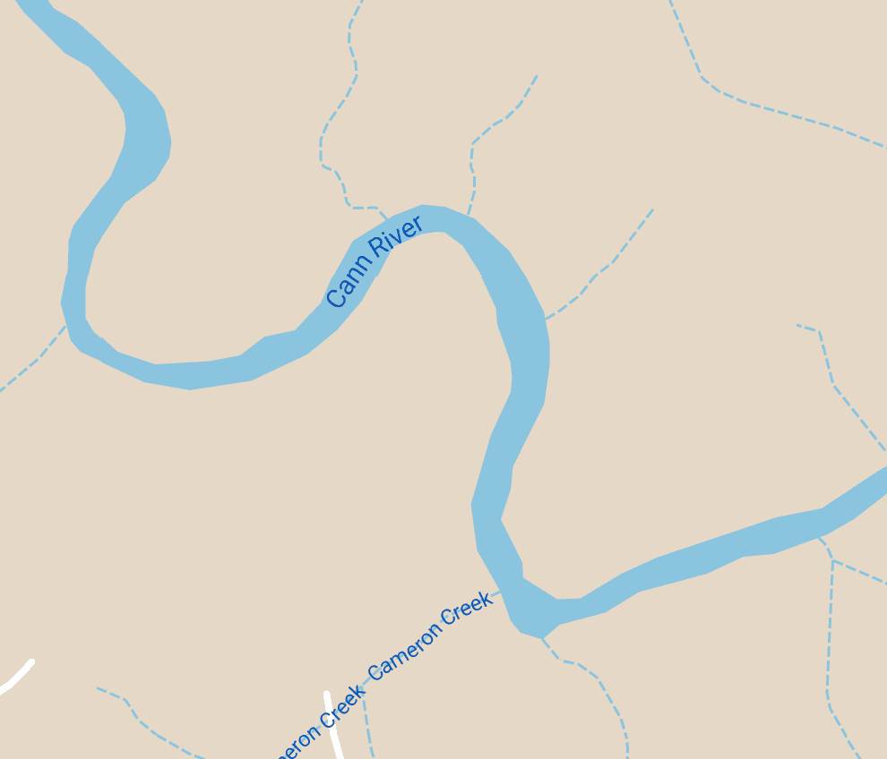

# 🔥 Forest Fires Industrial Mathematics 
## Overview
This project is an agent based model to simulate the spread of fire across a grid under various environmental conditions, including wind, rain, and varying vegetation densities.

## Features
### 🌲 Environmental Factors.
  - 8 directional wind 💨.
  - Rainfall to simulate suppression 🌧️.
  - Varying vegetation densities with different burn and re-growth rates 🌴🌳🌲.

  **NOTE:** We generate rain patterns and density using Perlin noise using [Salaxieb's Perlin noise Generator](https://github.com/salaxieb/perlin_noise/tree/master).

### ⚙️ Custom Visualisation Settings.
  - High, medium, or low-resolution grid options.
  - Custom Image Processing Pipeline to handle user inputted images for custom backgrounds.

### ✈️ Planes!
- Specify parameters of your plane in `settings.json` and watch it put out a fire!

## File Structure

```text
app/
├── perlin_noise/
│   ├── perlin_noise.py
│   ├── rand_vec.py
│   └── tools.py
│
├── plane_behaviour/
│   ├── plane.py
│   └── clustering.py
│
├── animate.py
├── * simulate.py
├── * image_processor.py
└── utils.py

results/
├── fire_sim.gif
├── processed.npy
└── processed.png

src/
├── real_world.jpg
├── real_world.npy
└── image.png

visualisations/
└── .gifs with varying scenarios


* settings.json
.gitignore
.gitattributes
README.md
```


- `simulate.py`: Main script for running the simulation.
- `settings.json`: Configuration file to customize simulation parameters.

## Configuration (settings.json)

Modify the `settings.json` file to control the simulation's behavior:

- **Simulation Settings:**
  - `quality`: `"low"`, `"medium"`, or `"high"` for different grid resolutions. Corresponding to $100\times100$, $200\times200$ or $300\times300$ respectively.
  - `time_steps`: how long you want the simulation to run.

- **Environmental Settings:**
  - `fire_probability`: Probability of fire igniting on each grid cell. Note that as your simulation quality increases this probability should decrease. Otherwise there will be too many fires starting.

  - `wind_direction`: Options include `"N"`, `"S"`, `"E"`, `"W"`, `"NW"`, `"NE"`, `"SW"`, `"SE"`. This refers to the direction where the wind is coming from. So a North wind direction would push the fire south.

  - `has_rain`: `true`/`false` to include rainfall generated by Perlin noise.

  - `has_varying_densities`: `true`/`false` for 4 varied vegetation densities.
  - `density_seed`: `null` or integer value. Setting `density_seed` to `null` generates a new density field each time. specifying a seed in the form of an integer keeps the density in the background constant.
  - `burn_time` and `grow_time`: Arrays specifying burn and growth rates for 4 of the vegetation densities. If `has_varying_densities` is `false` then the simulation takes the first value from each list.
  

- **Image Settings:**
  - `use_personal_image`: `true`/`false` to load a custom grid from an image file.
  - `image_path`: Path to the custom image.

- **Fire Suppression:**
  - `has_plane`: `true`/`false` to enable or disable the plane.
  - `plane_speed`: The maximum speed of the plane in terms of cells per time step.
  - `plane_radius`: The effective radius of the plane for fire surpression.

**NOTE:** By default the simulation uses the image provided in the `src/` directory.

### Some Recommendations

1. To make the animation run quick, set `quality` to `"medium"` and `time_steps` to `50`.
2. To observe the varying re-growth rates, `time_steps` should be set around `300`. However, this depends on your burn and growing times.
3. There is minimal error checking currently so ensure the settings are as specified.

## How to Run

### Personal Image
1. If you'd like to input your own area, head to this link and take a screenshot <a href="https://www.google.com/maps/d/viewer?mid=1OpMoz-v9iOYinQPbBzzx_lBT0QO8h-8&ll=-37.38159633507727%2C148.62546596105895&z=10" target="_blank">Forest Fires</a>.
2. Place your screenshot in the `src` directory and title it `image.png`
3. When running the `simulate.py` you will see a plot of your processed image. You can close out of this.
4. Follow the remaining steps.

Here's an example of a good candidate:

<p align="center">
  
</p>

### Running the simulation
1. Make sure your configurations are as you'd like them in the `settings.json` file.
2. Go to `app/` and run `simulate.py`.
3. You should see plots confirming your simulation. Check for any inconsistencies that may cause errors in the simulation, for example if you've started a fire on top of a river.
4. Once you close the plots, the simulation will run.
5. View your simulation in `results/fire_sim.gif`.

### HAPPY SIMULATING!